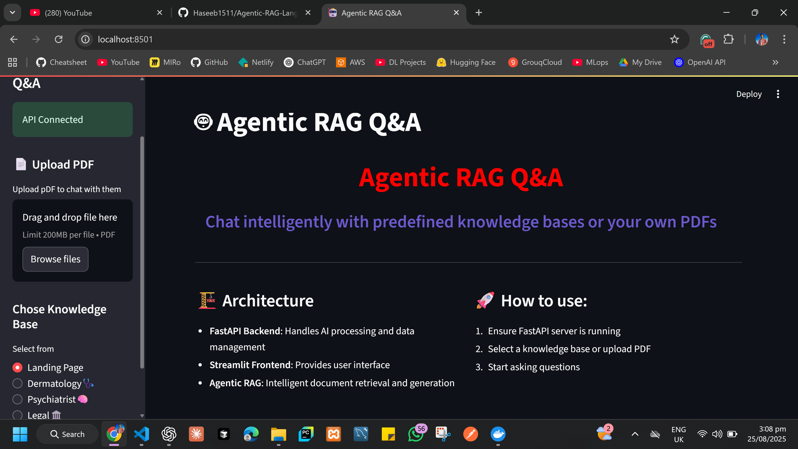
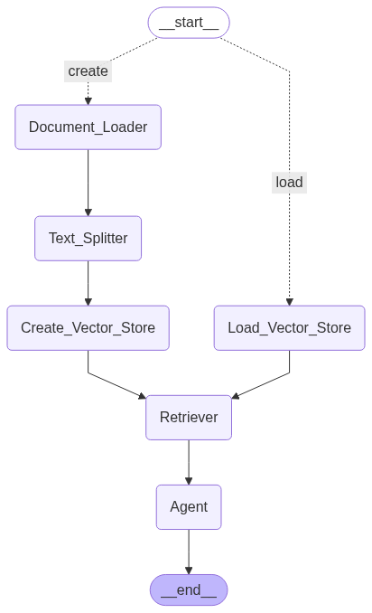

# 🧠 Agentic RAG Application  

An **Agentic Retrieval-Augmented Generation (RAG)** system built with **Streamlit (frontend)** and **FastAPI (backend)**.  
The project is modular, containerized with **Docker Compose**, and integrates advanced retrieval, memory, and persistence mechanisms.  

---

## 🎨 UI Preview



## 📊 Workflow Diagram




## 🚀 Features  

- **Multi-Domain Predefined Vector Stores**  
  - 🩺 Dermatology  
  - 🧠 Psychiatry  
  - ⚖️ Legal  
  - ➕ Upload & Chat with your own PDF  

- **Agentic Workflow**  
  - Modular agent design (`src/agent/agentic_workflow.py`)  
  - Flexible node system (`src/all_nodes/nodes.py`)  
  - Prompt library (`src/prompt_library/prompt.py`)  

- **Retrieval System**  
  - Hybrid Retrieval → **BM25 + Dense Embeddings**  
  - Coherence Ranker  
  - Redundant Document Filter  
  - LongContext Reorder  
  - Contextual Compression Retrieval  

- **Memory & Persistence**  
  - **SQLite Checkpointer** for chat persistence  
  - **Conversation Summary Memory** for contextual awareness  

- **Embeddings**  
  - Uses Google Generative AI embeddings  

- **Containerization**  
  - Fully dockerized using **Docker Compose**  

---

## 📂 Project Structure  

```

.
├── backend/
│   └── app.py                # FastAPI backend
├── frontend/
│   └── streamlit\_app.py      # Streamlit frontend
├── src/
│   ├── agent/
│   │   └── agentic\_workflow\.py
│   ├── all\_nodes/
│   │   └── nodes.py
│   ├── prompt\_library/
│   │   └── prompt.py
│   ├── model\_loader.py
│   ├── logger/
│   └── exception/
├── requirements.txt
├── docker-compose.yml
├── graph.png                 # Workflow diagram
├── ui\_images/                # UI screenshots
└── notebook/
├── notebook\_with\_conversationbuffermemory.ipynb
├── notebook\_with\_createvectorstore.ipynb
├── notebook\_with\_load\_vectorstore.ipynb
└── notebook\_with\_streaming.ipynb

````

---

## ⚙️ Installation  

### 1️⃣ Clone Repository  
```bash
git clone https://github.com/Haseeb1511/Agentic-RAG-LangGraph.git
cd agentic-rag-app
````

### 2️⃣ Setup Environment (Without Docker)

```bash
pip install -r requirements.txt
```

Run backend:

```bash
uvicorn backend.app:app --reload
```

Run frontend:

```bash
streamlit run frontend/streamlit_app.py
```

### 3️⃣ Run with Docker Compose (Recommended)

```bash
docker compose up --build
```

Access:

* Streamlit UI → [http://localhost:8501](http://localhost:8501)
* FastAPI Docs → [http://localhost:8000/docs](http://localhost:8000/docs)

## 🔑 Environment Setup

Create a `.env` file in the root directory:

```bash
GROQ_API_KEY=your_groq_api_key
OPENAI_API_KEY=your_openai_api_key
GOOGLE_API_KEY=your_google_api_key
COHERE_API_KEY=your_cohere_api_key
```

---

## 🛠️ Tech Stack

* **Frontend**: Streamlit
* **Backend**: FastAPI
* **Embeddings**: Google Generative AI
* **Vector Stores**: FAISS / BM25 / Hybrid Retrieval
* **Memory**: SQLite Checkpointer + Conversation Summary Memory
* **Deployment**: Docker Compose

---

## 🧑‍💻 Notebooks

* **notebook_with_conversationbuffermemory.ipynb**
* **notebook_with_createvectorstore.ipynb**
* **notebook_with_load_vectorstore.ipynb**
* **notebook_with_streaming.ipynb**

---

---

## ✅ Development Checklist

* [x] Agentic vector store
* [x] Memory
* [x] Node-based OOP design
* [x] Model OOP (Configurable)
* [x] Docker
* [x] FastAPI backend
* [ ] Streaming responses
* [ ] User-selectable models
* [ ] Logging & exception handling

📌 *SQLite checkpointer = your diary → keeps track of all past conversations.*

```

---

## ⚡ Installation

```bash
# Clone repo
git clone https://github.com/Haseeb1511/Agentic-RAG-LangGraph.git
cd <your-repo>

# Install dependencies
pip install -r requirements.txt
```

